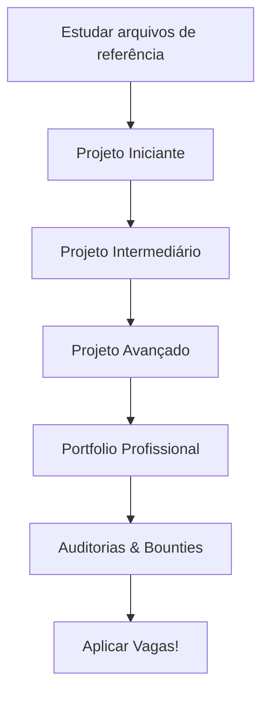

# 🏗️ Projetos Práticos - Do Básico ao Profissional

## 🎯 Objetivo

Este guia apresenta projetos práticos progressivos para consolidar o conhecimento de Solidity. Cada projeto usa conceitos dos arquivos de referência e prepara para o próximo nível.

---

## 📚 Como Usar Este Guia

1. **Complete os arquivos de referência primeiro**
2. **Escolha projetos do seu nível**
3. **Code, deploy, test**
4. **Compartilhe no GitHub**
5. **Receba feedback da comunidade**

---

## 🌱 NÍVEL 1: INICIANTE (Semanas 1-4)

### Projeto 1.1: Token ERC20 com Taxas
**Arquivos de referência**: DataTypes.sol, Functions.sol, Standards.sol

**Funcionalidades**:
- [ ] Transfer com taxa de 2%
- [ ] Whitelist sem taxas
- [ ] Burn automático da taxa
- [ ] Owner pode mudar taxa

**Desafios extras**:
- [ ] Adicionar pause mechanism
- [ ] Implementar max transaction amount
- [ ] Sistema de rewards para holders

**Tempo estimado**: 1 semana  
**Tecnologias**: Solidity 0.8.24, Hardhat, OpenZeppelin

---

### Projeto 1.2: Sistema de Votação Simples
**Arquivos de referência**: ControlFlow.sol, DataLocation.sol, Events

**Funcionalidades**:
- [ ] Criar proposta
- [ ] Votar (1 endereço = 1 voto)
- [ ] Finalizar votação
- [ ] Visualizar resultados

**Desafios extras**:
- [ ] Votação ponderada por tokens
- [ ] Time-lock para execução
- [ ] Delegation de votos

**Tempo estimado**: 1 semana  
**Tecnologias**: Solidity, Hardhat, Chai testing

---

### Projeto 1.3: NFT Collection com Minting
**Arquivos de referência**: Standards.sol (ERC721), Cryptography.sol

**Funcionalidades**:
- [ ] Mint NFT com preço fixo
- [ ] Max supply 10,000
- [ ] Metadata on-chain ou IPFS
- [ ] Owner pode retirar fundos

**Desafios extras**:
- [ ] Whitelist mint (Merkle tree)
- [ ] Reveal mechanism
- [ ] Royalties (ERC2981)

**Tempo estimado**: 1-2 semanas  
**Tecnologias**: Solidity, IPFS, Pinata, OpenZeppelin

---

### Projeto 1.4: Multi-Signature Wallet
**Arquivos de referência**: EtherTransfer.sol, Security.sol

**Funcionalidades**:
- [ ] Adicionar/remover owners
- [ ] Submeter transação
- [ ] Aprovar transação
- [ ] Executar após threshold

**Desafios extras**:
- [ ] Revogar aprovação
- [ ] Timelock para grandes valores
- [ ] ERC20 token support

**Tempo estimado**: 2 semanas  
**Tecnologias**: Solidity, Ethers.js, Testing frameworks

---

## 🌿 NÍVEL 2: INTERMEDIÁRIO (Semanas 5-12)

### Projeto 2.1: Staking Platform
**Arquivos de referência**: Patterns.sol, GasOptimization.sol, Security.sol

**Funcionalidades**:
- [ ] Stake ERC20 tokens
- [ ] Earn rewards over time
- [ ] Withdraw stakes + rewards
- [ ] Emergency withdraw

**Desafios extras**:
- [ ] Multiple reward tokens
- [ ] Boosted APY com lock period
- [ ] NFT staking
- [ ] Compound rewards automaticamente

**Tempo estimado**: 3 semanas  
**Tecnologias**: Solidity, Chainlink (optional), Subgraph

---

### Projeto 2.2: NFT Marketplace
**Arquivos de referência**: Standards.sol, Patterns.sol, Security.sol

**Funcionalidades**:
- [ ] List NFT for sale
- [ ] Buy NFT
- [ ] Cancel listing
- [ ] Offer system

**Desafios extras**:
- [ ] Auction mechanism
- [ ] Royalty enforcement
- [ ] Bundle sales
- [ ] ERC1155 support

**Tempo estimado**: 3-4 semanas  
**Tecnologias**: Solidity, IPFS, The Graph, Frontend

---

### Projeto 2.3: DEX Simples (AMM)
**Arquivos de referência**: Patterns.sol, GasOptimization.sol, Assembly.sol

**Funcionalidades**:
- [ ] Add/remove liquidity
- [ ] Swap tokens (x*y=k)
- [ ] LP tokens
- [ ] Fee collection

**Desafios extras**:
- [ ] Multiple pairs
- [ ] Price oracle
- [ ] Flash swaps
- [ ] Router contract

**Tempo estimado**: 4 semanas  
**Tecnologias**: Solidity, Uniswap V2 concepts, Math libraries

---

### Projeto 2.4: DAO Completo
**Arquivos de referência**: Patterns.sol, Standards.sol (ERC20), Cryptography.sol

**Funcionalidades**:
- [ ] Governance token (ERC20Votes)
- [ ] Create proposals
- [ ] Vote on proposals
- [ ] Execute proposals via Timelock

**Desafios extras**:
- [ ] Quadratic voting
- [ ] Delegation
- [ ] Treasury management
- [ ] Veto mechanism

**Tempo estimado**: 4-5 semanas  
**Tecnologias**: OpenZeppelin Governor, Timelock, Subgraph

---

## 🌳 NÍVEL 3: AVANÇADO (Semanas 13-24)

### Projeto 3.1: Lending/Borrowing Protocol
**Arquivos de referência**: Patterns.sol, Security.sol, GasOptimization.sol

**Funcionalidades**:
- [ ] Deposit collateral
- [ ] Borrow against collateral
- [ ] Repay loan
- [ ] Liquidation mechanism
- [ ] Interest accrual

**Desafios extras**:
- [ ] Multiple asset support
- [ ] Chainlink price feeds
- [ ] Flash loans
- [ ] Risk parameters (LTV, liquidation bonus)

**Tempo estimado**: 6-8 semanas  
**Tecnologias**: Solidity, Chainlink, Advanced math, Security audits

**Inspiração**: Aave, Compound

---

### Projeto 3.2: Options Protocol
**Arquivos de referência**: Patterns.sol, Assembly.sol, Cryptography.sol

**Funcionalidades**:
- [ ] Create call/put options
- [ ] Buy options
- [ ] Exercise options
- [ ] Settle options
- [ ] Pricing mechanism

**Desafios extras**:
- [ ] Automated market maker para options
- [ ] Strike price oracle
- [ ] Greeks calculation
- [ ] Portfolio management

**Tempo estimado**: 8-10 semanas  
**Tecnologias**: Solidity, Advanced DeFi, Oracles, Math libraries

**Inspiração**: Hegic, Opyn

---

### Projeto 3.3: Yield Aggregator
**Arquivos de referência**: Patterns.sol, GasOptimization.sol, Security.sol

**Funcionalidades**:
- [ ] Deposit funds
- [ ] Auto-compound strategies
- [ ] Multi-protocol farming
- [ ] Withdraw with profit
- [ ] Strategy management

**Desafios extras**:
- [ ] Dynamic strategy switching
- [ ] Gas optimization com batch transactions
- [ ] Emergency exit
- [ ] Performance fee

**Tempo estimado**: 8-10 semanas  
**Tecnologias**: Solidity, Multiple DeFi protocol integrations

**Inspiração**: Yearn Finance, Beefy

---

### Projeto 3.4: Cross-Chain Bridge
**Arquivos de referência**: Patterns.sol, Security.sol, Cryptography.sol

**Funcionalidades**:
- [ ] Lock tokens on chain A
- [ ] Mint wrapped tokens on chain B
- [ ] Burn wrapped tokens on chain B
- [ ] Unlock original tokens on chain A
- [ ] Relayer network

**Desafios extras**:
- [ ] Multiple chain support
- [ ] Liquidity pools
- [ ] Fee mechanism
- [ ] Security proofs

**Tempo estimado**: 10-12 semanas  
**Tecnologias**: Solidity, Multiple chains, Relayer, Cryptography

**Inspiração**: Wormhole, LayerZero

---

## 🏆 NÍVEL 4: PROFISSIONAL (Portfolio Projects)

### Projeto 4.1: Perpetual Futures Protocol
**Complexidade**: ⭐⭐⭐⭐⭐

**Funcionalidades**:
- [ ] Open long/short positions
- [ ] Leverage trading (up to 10x)
- [ ] Funding rate mechanism
- [ ] Liquidation engine
- [ ] Price oracles
- [ ] Insurance fund

**Tempo estimado**: 12-16 semanas  
**Inspiração**: dYdX, Perpetual Protocol

---

### Projeto 4.2: Liquid Staking Derivative
**Complexidade**: ⭐⭐⭐⭐⭐

**Funcionalidades**:
- [ ] Stake ETH
- [ ] Receive stETH (liquid token)
- [ ] Rewards distribution
- [ ] Unstaking mechanism
- [ ] Oracle for exchange rate

**Tempo estimado**: 12-16 semanas  
**Inspiração**: Lido, Rocket Pool

---

### Projeto 4.3: Privacy-Preserving Protocol
**Complexidade**: ⭐⭐⭐⭐⭐

**Funcionalidades**:
- [ ] Private transfers
- [ ] Zero-knowledge proofs
- [ ] Mixing mechanism
- [ ] Compliance layer (optional)

**Tempo estimado**: 16-20 semanas  
**Tecnologias**: Circom, snarkjs, Solidity  
**Inspiração**: Tornado Cash (educational purposes only)

---

## 📋 Template de Projeto

Para cada projeto, siga esta estrutura:

```
project-name/
├── contracts/
│   ├── Token.sol
│   ├── Staking.sol
│   └── ...
├── test/
│   ├── Token.test.js
│   └── ...
├── scripts/
│   ├── deploy.js
│   └── verify.js
├── hardhat.config.js
├── README.md (explicação do projeto)
├── ARCHITECTURE.md (design decisions)
└── SECURITY.md (considerações de segurança)
```

---

## ✅ Checklist de Qualidade

Para cada projeto completo:

### Código
- [ ] Código comentado (NatSpec)
- [ ] Seguir conventions do BestPractices.sol
- [ ] Custom errors (não require strings)
- [ ] Events para state changes importantes
- [ ] Gas optimized

### Testes
- [ ] Unit tests (>90% coverage)
- [ ] Integration tests
- [ ] Fuzz tests
- [ ] Edge cases cobertos

### Segurança
- [ ] Reentrancy protection
- [ ] Access control adequado
- [ ] Input validation
- [ ] Checks-Effects-Interactions pattern
- [ ] Slither analysis sem critical issues

### Documentação
- [ ] README com instruções claras
- [ ] Architecture document
- [ ] Security considerations
- [ ] Deployment guide

### Deploy
- [ ] Testnet deployment (Sepolia)
- [ ] Contract verification
- [ ] Frontend (opcional mas recomendado)
- [ ] Demo video ou screenshots

---

## 🎯 Showcase no Portfolio

### GitHub README Template

```markdown
# [Nome do Projeto]

![Banner do projeto]

## 🌟 Highlights
- Feature 1
- Feature 2
- Feature 3

## 🏗️ Arquitetura
[Diagrama ou descrição]

## 🔒 Segurança
- Auditoria: [link se tiver]
- Testes: [coverage %]
- Ferramentas: Slither, Mythril

## 🚀 Deployed Contracts
- Sepolia: 0x...
- Mainnet: 0x... (se aplicável)

## 📺 Demo
[Link para vídeo ou live demo]

## 🛠️ Tech Stack
- Solidity 0.8.24
- Hardhat / Foundry
- OpenZeppelin
- Chainlink (se usar)

## 📝 License
MIT
```

---

## 🤝 Comunidade

### Code Reviews
- Submeta PRs no repo principal
- Peça review de pelo menos 2 pessoas
- Revise código de outros

### Compartilhamento (opcional)
- Twitter thread explicando o projeto
- LinkedIn post técnico
- YouTube video walkthrough
- Medium article (opcional)

---

## 💼 Preparação para Entrevistas

### Portfolio Ideal
1. ✅ 1 projeto de cada nível
2. ✅ Pelo menos 1 projeto avançado completo
3. ✅ Contribuições open-source
4. ✅ Participation em auditorias (Code4rena)
5. ✅ Bug bounty findings (Immunefi)

### Demonstração em Entrevistas
- **5min**: Explicar arquitetura de alto nível
- **10min**: Code walkthrough das partes críticas
- **5min**: Discussão de security & gas optimization
- **5min**: Q&A - Responder perguntas técnicas, discutir trade-offs, defender decisões de design 

---

## 📈 Progressão Sugerida



---

**Comece hoje! O melhor projeto é aquele que você realmente constrói.** 🚀

**Lembre-se**: Empresas não contratam por conhecimento teórico. Elas contratam por **código que você pode mostrar**.
